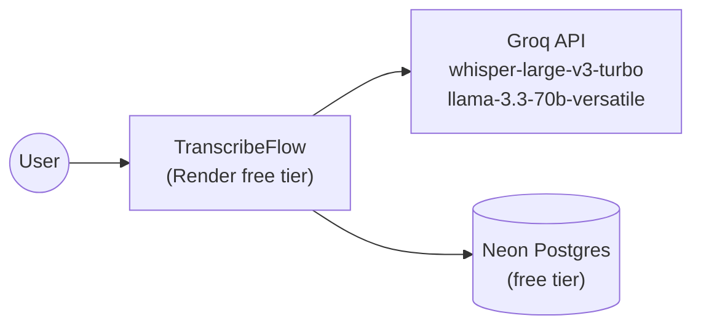

# Architecture Overview

High-level architecture of TranscribeFlow. Decisions are recorded in `docs/adr/`; the product definition is `docs/prd.md`.

## Architectural Characteristics (Ilities)

1. **Usability (NFR4.1)**: live status feedback via 202 + polling.
2. **Reliability (NFR3.x)**: state restorable after refresh; orphaned jobs reconciled on restart.
3. **Responsiveness (NFR1.x)**: processing never blocks a request thread's response.
4. **Cost (NFR5.1)**: every component fits a genuinely free tier — this is a first-class architectural driver, not an afterthought.
5. **Maintainability**: modular monolith + hexagonal layers keep provider/vendor churn isolated.
6. **Privacy (NFR2.1)**: media is never persisted.

## Architectural Style: Modular Monolith (ADR-001)

One deploy unit (Django project) with enforced logical separation. Modules are service-layer groupings, not separate Django apps, until scale demands otherwise.

## Logical Layers — Hexagonal / Ports & Adapters (ADR-002)

- **Domain**: pure logic, no Django/IO — `TranscriptData` mapping, SRT/TXT formatting.
- **Service layer (use cases)**: `start_transcription`, `run_transcription_job`, `update_segment_text`, `generate_summary`, `get_export_data`. Receives provider ports by injection.
- **Ports**: `TranscriptionProvider`, `SummaryProvider` protocols (ADR-003).
- **Adapters (driven)**: `GroqTranscriptionAdapter`, `GroqSummaryAdapter`, `FakeTranscriptionAdapter`, `FakeSummaryAdapter` (ADR-006). Selected via settings.
- **Adapters (driving)**: DRF views/serializers (HTTP), React SPA (ADR-009).
- **Infrastructure**: Django ORM (repository), ThreadPoolExecutor job runner (ADR-007), WhiteNoise static serving (ADR-008).

## Module Decomposition

1. **Transcription**: upload validation, job lifecycle, provider call, segment persistence.
2. **Editor**: segment text updates.
3. **Export**: `Transcript → .txt / .srt` formatting (pure functions).
4. **Summary**: on-demand LLM summarization of current transcript text.

## Runtime Data Flow

```
Browser (React SPA)
  │ 1. POST /api/transcriptions/ (multipart)
  ▼
DRF view ── validate ── create row (pending) ── submit job ──► 202 {id}
  │                                        │
  │ 2. poll GET /api/transcriptions/{id}/  │ ThreadPoolExecutor (ADR-007)
  ▼                                        ▼
status from DB ◄── processing → Groq STT → segments bulk-created → completed
                                                  (media discarded)
  3. PATCH /api/segments/{id}/          — inline edits
  4. POST .../summarize/  → Groq LLM    — on-demand summary
  5. GET  .../export/?format=txt|srt    — download (edited text)
```

## Deployment View (ADR-008)

```
Render free web service ── one process: gunicorn (threaded)
  ├── Django + DRF (API)
  ├── WhiteNoise (built React SPA + statics)
  └── ThreadPoolExecutor (jobs)
        │
        ├──► Groq API (STT + LLM)      [free tier]
        └──► Neon Postgres (state)     [free tier]
```

## System Context Diagram


